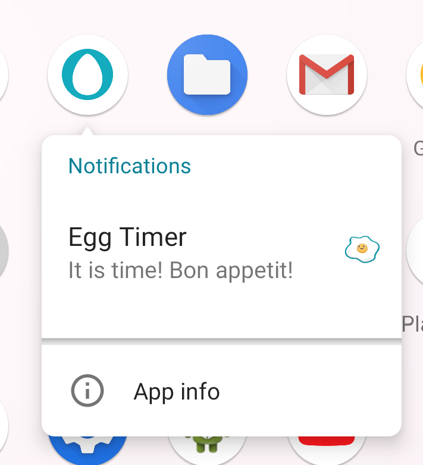

# Kotlin4Android
Android apps made with Kotlin

## 6. Android Kotlin Notification
#### Kotlin Structure
* /receiver—The receiver package contains two broadcast receivers named AlarmReceiver and SnoozeReceiver. AlarmReceiver is triggered by the AlarmManager to send the notification when the user-defined timer is up. SnoozeReceiver handles the user click to snooze the notification.
* /ui—This contains the EggTimerFragment which is part of the UI portion of the app. EggTimerViewModel is responsible for starting and canceling the timer and for other lifecycle-related app tasks.
* /util—In this package there are two files. BindingUtils.kt has binding adapters to enable data binding between the app UI and the ViewModel. NotificationUtils.kt has extension methods on the NotificationManager.

#### Style your notification.
NotificationCompat offers built-in styles for:
* BigTextStyle, which can display a large block of text, such as showing the contents of an email when expanded.
* BigPictureStyle, which shows large-format notifications that include a large image attachment.
* InboxStyle, which shows a conversation style text content.
* MediaStyle, which shows controls for media playback.
* MessagingStyle, which shows large-format notifications that include multiple messages between any number of people.

#### Notification badges.
Notification badges are small dots that appear on the launcher icon of the associated app when the app has an active notification. Users can long-press on the app icon to reveal the notifications.
 

#### Summary
* Using NotificationManager class to create, send, update, and cancel a notification using.
* A NotificationChannel object with the createNotificationChannel method to set a channel for the notification.
* Using addAction() to add quick actions to a notification.
* Using setShowBadge() to enable or disable badges,.
* Styling notifications using styles which extends from Notification.Style
* Setting importance level with NotificationChannel.setImportance()
